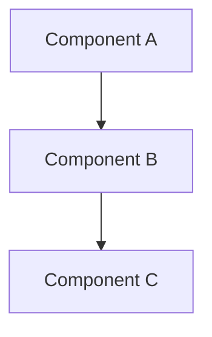

## Architecture Specification

### Basic Information
- **Name:** 
- **Category:** [ ] Cognitive / [ ] Orchestration / [ ] Knowledge System / [ ] Security / [ ] Operational
- **Maturity Target:** [ ] Concept / [ ] Alpha / [ ] Beta / [ ] Production

### Problem Statement
Describe the problem this architecture solves:

### Proposed Solution
Describe the architectural approach:

### Components Required
- [ ] Vector DB
- [ ] LLM
- [ ] MCP Integration
- [ ] Supabase
- [ ] Blockchain
- [ ] Graph DB
- [ ] Other: ___________

### Agent Requirements
List agents needed for this architecture:

1. 
2. 
3. 

### Complexity Assessment
- [ ] Low (< 5 components, < 3 agents)
- [ ] Medium (5-10 components, 3-7 agents)
- [ ] High (> 10 components, > 7 agents)

### Integration with Existing Architectures

| Existing Architecture | Integration Type | Description |
|-----------------------|------------------|-------------|
| EC-RAG | | |
| MCP-Swarm | | |
| RCOP | | |

### Technical Diagram

### Performance Requirements
- **Target Latency:** 
- **Throughput:** 
- **Scalability:** 

### Success Criteria
- [ ] Functional requirements met
- [ ] Performance benchmarks achieved
- [ ] Integration tests passed
- [ ] Documentation completed
- [ ] Security review approved

### Rollout Plan
1. **Phase 1 (Concept):** 
2. **Phase 2 (Alpha):** 
3. **Phase 3 (Beta):** 
4. **Phase 4 (Production):** 

---

### Review Checklist
- [ ] Architecture design reviewed
- [ ] Component dependencies validated
- [ ] Agent contracts defined
- [ ] Integration points documented
- [ ] Security implications assessed
- [ ] Cost analysis completed
- [ ] Notion catalog entry created
- [ ] Documentation merged