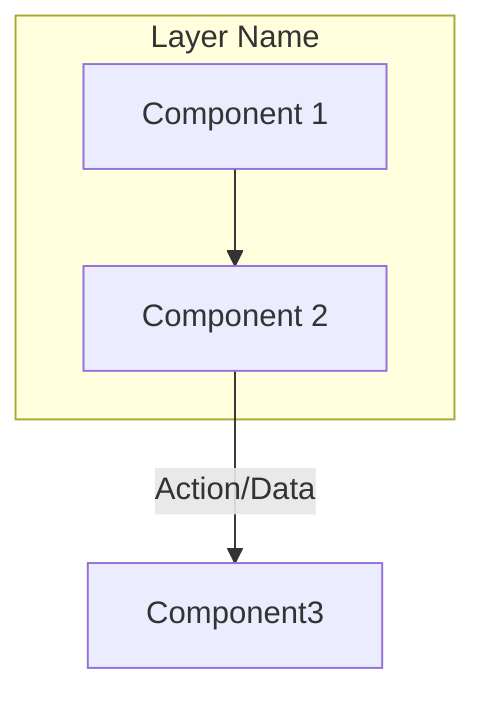

# Contributing to Agent Swarm Matrix Documentation

Thank you for your interest in contributing to the Agent Swarm Matrix (ASM) documentation! This guide will help you understand our processes and best practices.

## 👋 Getting Started

### Prerequisites

- Node.js 18+ (for sync scripts)
- Git
- Access to Notion workspace (for full integration)
- GitHub account

### Setup

1. **Fork the repository**
   ```bash
   git clone https://github.com/GaboBase/gabobase-ASM-docs.git
   cd gabobase-ASM-docs
   ```

2. **Install dependencies**
   ```bash
   npm install
   ```

3. **Set up environment variables**
   ```bash
   cp .env.example .env
   # Edit .env with your Notion API key and database IDs
   ```

4. **Verify setup**
   ```bash
   npm run validate
   ```

## 📝 Types of Contributions

### 1. Adding a New Agent

To propose a new agent for the Agent Swarm Matrix:

1. **Create an issue using the "New Agent" template**
   - Fill out all required fields
   - Include clear trigger conditions
   - Provide a complete tool schema

2. **Create the agent contract**
   ```bash
   # Create a new contract file
   touch contracts/my-new-agent.json
   ```

3. **Define the contract** (see [Agent Contract Template](#agent-contract-template))

4. **Validate the contract**
   ```bash
   npm run validate:contracts -- --file=contracts/my-new-agent.json
   ```

5. **Submit a pull request**
   - Reference the issue you created
   - Include documentation in `/docs/agents/my-new-agent.md`

### 2. Adding a New Architecture

To propose a new architecture:

1. **Create an issue using the "Architecture Proposal" template**

2. **Create documentation**
   ```bash
   touch docs/architectures/my-architecture.md
   ```

3. **Include in documentation:**
   - Overview and philosophy
   - Architecture diagram (Mermaid)
   - Component breakdown
   - Agent interactions
   - Configuration examples
   - Usage examples
   - Performance metrics
   - Integration points

4. **Update architecture catalog**
   - Add entry to `data/architectures.json`
   - Update README.md architecture table

### 3. Improving Documentation

- Fix typos, grammar, or clarity issues
- Add examples or use cases
- Improve diagrams
- Add missing information

### 4. Updating Notion Integration

- Improve sync scripts
- Add new automation workflows
- Enhance validation logic

## 📋 Templates & Standards

### Agent Contract Template

```json
{
  "name": "My Agent Name",
  "version": "1.0.0",
  "category": "Reasoning",
  "status": "Development",
  "executionPattern": "Sequential",
  "architectures": ["MCP-Swarm"],
  "mcpEnabled": true,
  "costTier": "Medium",
  "priority": 5,
  "description": "Clear description of what this agent does and when to use it",
  
  "triggerConditions": {
    "type": "conditional",
    "condition": {
      "expression": "task.complexity > 0.7 && task.requires_reasoning == true",
      "variables": {
        "task.complexity": "float",
        "task.requires_reasoning": "boolean"
      }
    }
  },
  
  "toolSchema": {
    "input": {
      "parameters": {
        "query": {
          "type": "string",
          "description": "The input query",
          "required": true
        },
        "context": {
          "type": "object",
          "description": "Additional context",
          "required": false
        }
      },
      "required": ["query"]
    },
    "output": {
      "format": "json",
      "schema": {
        "result": {"type": "string"},
        "confidence": {"type": "number"},
        "metadata": {"type": "object"}
      }
    }
  },
  
  "integrationPoints": ["MCP Gateway", "Supabase"],
  "knowledgeSources": ["Vector DB", "Notion"],
  "dependencies": ["llm_processor"],
  
  "performance": {
    "avgLatency": "2.3s",
    "successRate": 0.94,
    "throughput": "50 req/min"
  }
}
```

### Documentation Standards

#### File Structure

```
docs/
├── cognitive/           # Cognitive architectures (RCOP, MetaReasoner, FLSIN)
├── core-frameworks/     # Core frameworks (EC-RAG, MCP-Swarm)
├── operational/         # Operational frameworks (GenOps, HMMAF, DCE)
├── agents/              # Individual agent documentation
├── guides/              # How-to guides and tutorials
└── generated/           # Auto-generated docs (don't edit manually)
```

#### Markdown Guidelines

1. **Use clear headings**
   - H1 for title only
   - H2 for major sections
   - H3 for subsections

2. **Include diagrams**
   - Use Mermaid for architecture diagrams
   - Keep diagrams simple and focused
   - Always include alt text

3. **Code examples**
   - Use syntax highlighting
   - Include complete, runnable examples
   - Add comments for clarity

4. **Links**
   - Use relative links for internal docs
   - Use absolute URLs for external resources
   - Keep links up to date

5. **Emojis**
   - Use sparingly for visual scanning
   - Common usage: 🎯 Overview, 🏗️ Architecture, 🤖 Agents, 📊 Metrics, 🔧 Config

#### Mermaid Diagram Standards



## ✅ Pull Request Process

### Before Submitting

1. **Validate contracts**
   ```bash
   npm run validate:contracts --all
   ```

2. **Run linting**
   ```bash
   npm run lint
   ```

3. **Build documentation**
   ```bash
   npm run build:docs
   ```

4. **Test locally**
   ```bash
   npm run serve
   # Visit http://localhost:3000
   ```

### PR Requirements

- [ ] Clear title describing the change
- [ ] Description explaining why this change is needed
- [ ] All contracts pass validation
- [ ] Documentation is updated (if applicable)
- [ ] Links in README are working
- [ ] No merge conflicts
- [ ] At least one reviewer assigned

### PR Template

```markdown
## Description
[Brief description of changes]

## Type of Change
- [ ] New agent
- [ ] New architecture
- [ ] Documentation improvement
- [ ] Bug fix
- [ ] Script/automation improvement

## Checklist
- [ ] Contract validation passed
- [ ] Documentation updated
- [ ] Examples provided
- [ ] Tests added (if applicable)
- [ ] README updated (if applicable)

## Related Issues
Closes #[issue number]

## Screenshots (if applicable)
[Add screenshots of diagrams, UI changes, etc.]
```

## 🧪 Testing

### Unit Tests

For validation scripts:
```bash
npm run test:unit
```

### Integration Tests

For Notion sync:
```bash
npm run test:integration
```

### Manual Testing Checklist

- [ ] Contract validates successfully
- [ ] Documentation builds without errors
- [ ] Links work correctly
- [ ] Diagrams render properly
- [ ] Code examples run successfully
- [ ] Notion sync works (if applicable)

## 🔒 Security

### Never Commit

- API keys or tokens
- Environment files (`.env`)
- Personal information
- Production credentials

### Reporting Security Issues

Please email security@gabobase.dev instead of creating a public issue.

## 💬 Communication

### Where to Ask Questions

- **General questions:** GitHub Discussions
- **Bug reports:** GitHub Issues
- **Feature requests:** GitHub Issues with "enhancement" label
- **Architecture discussions:** GitHub Discussions

### Response Times

- **Bug reports:** Within 48 hours
- **Feature requests:** Within 1 week
- **Pull requests:** Within 3 business days

## 🏆 Recognition

Significant contributors will be:
- Added to CONTRIBUTORS.md
- Mentioned in release notes
- Credited in documentation

## 📚 Resources

### Essential Reading

- [Agent Swarm Matrix Overview](README.md)
- [Architecture Catalog](docs/architectures/)
- [Agent Registry](docs/generated/agents.md)
- [MCP Integration Guide](docs/guides/mcp-integration.md)

### External Resources

- [Mermaid Documentation](https://mermaid-js.github.io/)
- [JSON Schema Guide](https://json-schema.org/learn/)
- [Notion API](https://developers.notion.com/)
- [GitHub Actions](https://docs.github.com/en/actions)

## 🔄 Synchronization with Notion

### How It Works

1. **Notion is the source of truth** for agent and architecture metadata
2. **GitHub Actions** sync data every 6 hours
3. **Manual sync** can be triggered via:
   ```bash
   npm run sync:notion
   ```

### Sync Process

```
Notion Database → GitHub Actions → JSON files → Generated Docs → README badges
```

### When to Sync Manually

- After adding a new agent to Notion
- After updating architecture status
- Before submitting a PR that references Notion data

### Sync Conflicts

If sync fails:
1. Check GitHub Actions logs
2. Verify Notion API key
3. Ensure database IDs are correct
4. Check for schema changes

## ❓ FAQ

**Q: How do I test my agent locally?**  
A: Use the agent test harness: `npm run test:agent -- --name=my-agent`

**Q: Can I edit generated documentation?**  
A: No, edit the source in Notion or the generation scripts instead.

**Q: How often should I sync with Notion?**  
A: Automatically every 6 hours, or manually when making changes.

**Q: What if my PR doesn't pass validation?**  
A: Check the errors in the GitHub Actions log and fix them before resubmitting.

**Q: Can I add a new category for agents?**  
A: Yes, but propose it in a GitHub Discussion first for community input.

## 🚀 Quick Commands

```bash
# Sync from Notion
npm run sync:notion

# Validate all contracts
npm run validate:contracts --all

# Validate single contract
npm run validate:contracts -- --file=contracts/my-agent.json

# Build documentation
npm run build:docs

# Serve locally
npm run serve

# Run all tests
npm test

# Lint all code
npm run lint

# Format code
npm run format
```

## 🔗 Links

- [Repository](https://github.com/GaboBase/gabobase-ASM-docs)
- [Issues](https://github.com/GaboBase/gabobase-ASM-docs/issues)
- [Discussions](https://github.com/GaboBase/gabobase-ASM-docs/discussions)
- [Notion Workspace](https://www.notion.so/ce55a73f69e34d3a965f70014468af28)

---

**Thank you for contributing to Agent Swarm Matrix! 🚀🤖**

Questions? Open a [GitHub Discussion](https://github.com/GaboBase/gabobase-ASM-docs/discussions).