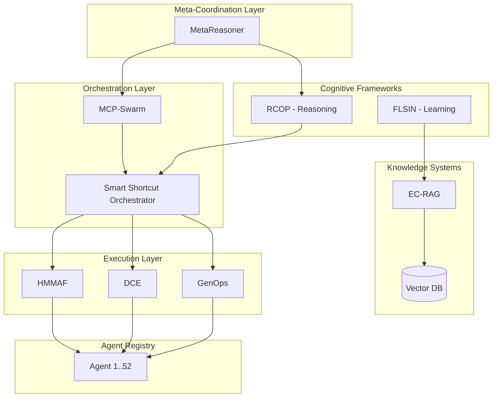

# 🧠 Agent Swarm Matrix (ASM)

[](https://www.notion.so/4f83c29038c74710a9e2b56bd1c35c3c)
[](https://www.notion.so/ce55a73f69e34d3a965f70014468af28)
[](https://www.notion.so/2ea75015623781488401c14ded93b1ff)

> **Consolidated documentation hub for massive multi-agent orchestration framework**  
> Integrates PrompTitecture architectures, MCP-Swarm orchestration, Notion-driven knowledge base, contract-based autonomy, and production-grade tools registry.

---

## 🎯 Overview

**Agent Swarm Matrix (ASM)** is a comprehensive multi-agent ecosystem that combines cognitive architectures, execution frameworks, and autonomous coordination patterns to deliver production-grade AI solutions.

### Key Features
- **52+ Specialized Agents** with contract-based autonomy
- **8 Core Architectures** (EC-RAG, MCP-Swarm, RCOP, FLSIN, HMMAF, MetaReasoner, GenOps, DCE)
- **4-Level Autonomy Hierarchy** (Supervised → Self-Improving)
- **MCP Protocol Integration** for knowledge access
- **Notion-GitHub Sync** for live documentation
- **Blockchain Anchoring** for trust & auditability

---

## 🏗️ Architecture Overview



---

## 📚 Core Frameworks

| Framework | Type | Maturity | Description | Docs |
|-----------|------|----------|-------------|------|
| **[EC-RAG](./docs/core-frameworks/EC-RAG.md)** | Knowledge System | Production | Evolution-aware RAG with drift detection | [📖](./docs/core-frameworks/EC-RAG.md) |
| **[MCP-Swarm](./docs/core-frameworks/MCP-Swarm.md)** | Orchestration | Production | Model Context Protocol orchestrator | [📖](./docs/core-frameworks/MCP-Swarm.md) |
| **[RCOP](./docs/cognitive/RCOP.md)** | Cognitive | Beta | Recursive Chain of Prompts reasoning | [📖](./docs/cognitive/RCOP.md) |
| **[FLSIN](./docs/cognitive/FLSIN.md)** | Learning | Alpha | Federated Learning with selective integration | [📖](./docs/cognitive/FLSIN.md) |
| **[HMMAF](./docs/operational/HMMAF.md)** | Content | Beta | Hybrid Multi-Modal Agentic Framework | [📖](./docs/operational/HMMAF.md) |
| **[MetaReasoner](./docs/cognitive/MetaReasoner.md)** | Meta-Coordination | Alpha | Meta-level agent selection optimizer | [📖](./docs/cognitive/MetaReasoner.md) |
| **[GenOps](./docs/operational/GenOps.md)** | Operations | Beta | Generative Operations automation | [📖](./docs/operational/GenOps.md) |
| **[DCE](./docs/operational/DCE.md)** | Execution | Beta | Dynamic Context Expansion | [📖](./docs/operational/DCE.md) |

---

## 🤖 Agent Registry

**52+ specialized agents** organized by category:

### Core Orchestration (5 agents)
- Smart Shortcut Orchestrator
- Intent Analyzer
- MetaReasoner Coordinator
- State Machine Manager
- Swarm Executor

### AI/ML (12 agents)
- LLM Processor, Embedding Generator, Prompt Optimizer
- Model Fine-Tuner, Inference Engine, Vector Search
- Drift Detector, Context Manager, Token Optimizer
- Reasoning Engine, Counterfactual Analyzer, Pattern Miner

### Web Development (8 agents)
- Frontend Builder, Backend API Designer, Database Schema Generator
- UI/UX Optimizer, Performance Analyzer, SEO Optimizer
- Accessibility Checker, PWA Builder

### Data Engineering (7 agents)
- ETL Orchestrator, Data Quality Monitor, Schema Migrator
- Pipeline Optimizer, Stream Processor, Batch Scheduler
- Data Catalog Manager

### Security (6 agents)
- Vulnerability Scanner, Auth Manager, Encryption Handler
- Audit Logger, Threat Detector, Compliance Checker

### DevOps (8 agents)
- CI/CD Manager, Container Orchestrator, Infrastructure Provisioner
- Monitoring Agent, Log Aggregator, Incident Responder
- Backup Manager, Deployment Validator

### Content (4 agents)
- Content Generator, Multi-Modal Processor, Translation Engine
- Quality Scorer

### Business Intelligence (2 agents)
- Analytics Engine, Report Generator

> **Full registry:** [Notion Agent Registry](https://www.notion.so/4f83c29038c74710a9e2b56bd1c35c3c)

---

## 🔗 Integration & Triggers

### Contract-Based Execution

Agents are triggered via **contract-driven actions** that support:

**Sequential Execution:**
```json
{
  "trigger": "contract_approved",
  "sequential": [
    "validate_requirements",
    "generate_wbs",
    "estimate_resources"
  ]
}
```

**Parallel Execution:**
```json
{
  "trigger": "project_init",
  "parallel": [
    "create_repo_structure",
    "assign_agents",
    "initialize_blockchain_anchor"
  ]
}
```

**Conditional Logic:**
```json
{
  "trigger": "risk_assessment_complete",
  "conditional": {
    "if": "risk_score > 0.7",
    "then": ["request_human_approval"],
    "else": ["proceed_autonomous"]
  }
}
```

### MCP Integration

Agents access GitHub repos as knowledge sources via **Model Context Protocol**:

```typescript
import { MCPServer } from '@modelcontextprotocol/sdk';

const server = new MCPServer({
  name: 'ASM-Knowledge-Server',
  version: '1.0.0',
  resources: [
    {
      uri: 'github://GaboBase/*',
      type: 'repository'
    },
    {
      uri: 'notion://4f83c29038c74710a9e2b56bd1c35c3c',
      type: 'database'
    }
  ]
});
```

---

## 🚀 Quick Start

### 1. Clone Repository
```bash
git clone https://github.com/GaboBase/gabobase-ASM-docs.git
cd gabobase-ASM-docs
```

### 2. Install Dependencies
```bash
npm install
```

### 3. Configure Notion Integration
```bash
cp .env.example .env
# Add your Notion API key and database IDs
```

### 4. Run Documentation Server
```bash
npm run docs:dev
```

### 5. Deploy Agent
```bash
npm run deploy:agent <agent-name>
```

---

## 📊 Ecosystem Dashboard

**Live metrics** tracked via Notion + GitHub Actions:

- ✅ **Active Agents:** 52
- 🏗️ **Architectures in Use:** 8
- 📦 **Repositories Managed:** 15+
- 🔄 **Daily Executions:** ~1,200
- 📈 **Avg Success Rate:** 94.3%
- ⚡ **Avg Latency:** 1.8s

> **Dashboard:** [Massive Execution Matrix](https://www.notion.so/2ea75015623781488401c14ded93b1ff)

---

## 📖 Documentation Structure

```
├── docs/
│   ├── core-frameworks/          # EC-RAG, MCP-Swarm
│   ├── cognitive/                 # RCOP, FLSIN, MetaReasoner
│   ├── operational/               # GenOps, DCE, HMMAF
│   ├── agents/                    # Agent-specific docs
│   ├── integration/               # MCP, webhooks, APIs
│   └── deployment/                # Deployment guides
├── .github/
│   ├── workflows/                 # Auto-documentation CI/CD
│   └── ISSUE_TEMPLATE/            # Contract templates
├── scripts/
│   └── sync-notion.js             # Notion↔GitHub sync
└── README.md
```

---

## 🔄 Webhooks & Automation

### Notion → GitHub Sync

Changes in Notion databases trigger GitHub updates:

```javascript
// Webhook endpoint
POST /api/webhooks/notion

// Syncs:
// - Agent contracts → GitHub Issues
// - Architecture updates → Markdown docs
// - Metrics → README badges
```

### GitHub Actions

- **Auto-documentation:** Generates agent docs from code
- **Contract validation:** Validates agent contracts on PR
- **Deployment pipeline:** Deploys agents to production
- **Notion sync:** Pushes changes back to Notion

---

## 🤝 Contributing

See [CONTRIBUTING.md](./CONTRIBUTING.md) for:
- Agent development guidelines
- Architecture proposal process
- Contract specifications
- Testing requirements

---

## 📝 License

MIT © 2026 Gabriel (GaboBase)

---

## 🔗 Links

- **Notion Workspace:** [Agent Registry](https://www.notion.so/4f83c29038c74710a9e2b56bd1c35c3c) | [Architecture Catalog](https://www.notion.so/ce55a73f69e34d3a965f70014468af28)
- **ChatGPT Integration:** [Agent Swarm Matrix GPT](https://chatgpt.com/g/g-p-6975f5cae62c81919155961a2adfe44a-agent-swarm-matrix/c/6975f5ee-f740-8333-93db-d8bf778feac8)
- **PrompTitecture:** [Documentation](https://perplexity.ai/spaces/promptitecture-WS0PmhJCS6GHiG_MKodetg)

---

**Built with ❤️ using PrompTitecture framework**