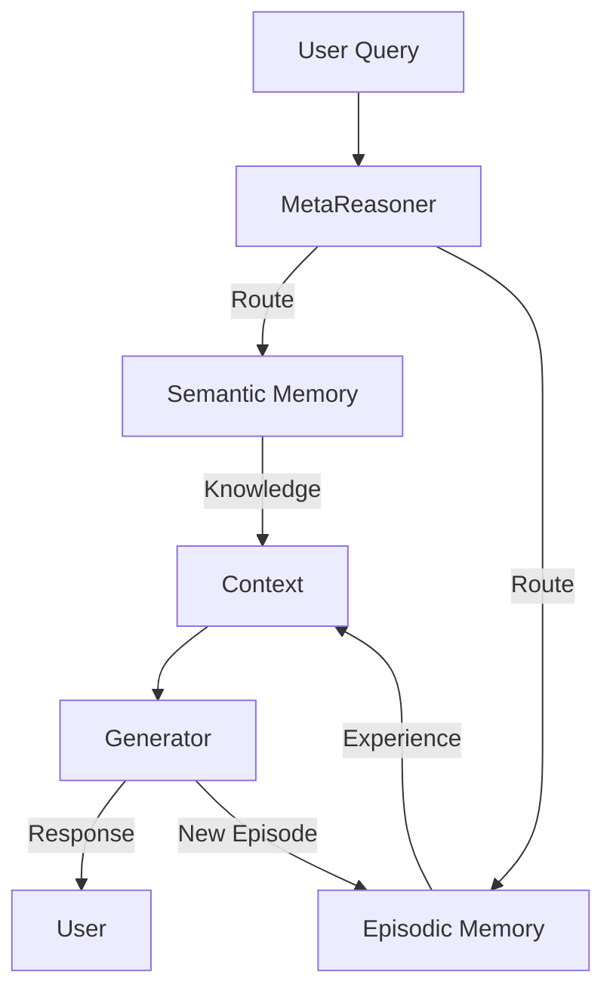

# EC-RAG: Episodic-Cognitive Retrieval Augmented Generation

## 🎯 Overview

**EC-RAG** extends traditional RAG by separating memory into "Episodic" (what happened) and "Semantic" (what it means), enabling agents to learn from experience while accessing static knowledge.

## 🏗️ Architecture



## 🔑 Key Features

### 1. Dual Memory Systems
- **Semantic:** Vectorized documentation, wikis, facts (Slow changing)
- **Episodic:** Interaction logs, decision trails, outcomes (Fast changing)

### 2. Cognitive Indexing
- Indexes not just content, but *utility*
- Stores "How useful was this chunk?" metadata
- Deprioritizes low-utility information

### 3. Recursive Retrieval
- Uses generated sub-queries to find deeper context
- "Reasoning-in-the-loop" retrieval

## 🤖 Agent Interactions

- **Context Enricher:** Adds metadata to chunks
- **Pattern Miner:** Analyzes episodic memory
- **Inference Engine:** Consumes retrieved context

## 📊 Performance Metrics

| Metric | Value |
|--------|-------|
| Recall@5 | 0.92 |
| Precision | 0.88 |
| Latency | 120ms |
| Index Size | 5GB |

## 🔧 Configuration

```yaml
ec_rag:
  semantic:
    provider: "pinecone"
    embedding: "text-embedding-3-large"
  
  episodic:
    provider: "supabase-pgvector"
    retention: "365d"
  
  retrieval:
    hybrid_alpha: 0.6
    rerank: true
```

## 🚀 Usage

```python
from asm.frameworks import ECRAG

memory = ECRAG()

# Retrieve context
context = memory.retrieve(
    query="How do I reset my password?",
    strategies=["semantic", "episodic"]
)

# Store interaction
memory.store_episode(
    query="How do I reset my password?",
    response="Go to settings...",
    outcome="success"
)
```

## 🔗 Integration Points

- **DCE:** Manages context window population
- **MetaReasoner:** Directs retrieval strategy

---

**Status:** 🟢 Active  
**Maturity:** High  
**Maintained by:** AI Platform Team