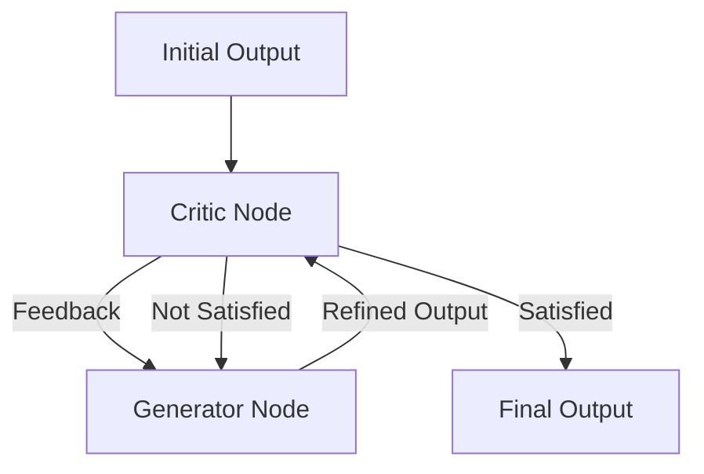

# RCOP: Recursive Chain of Thought Optimization

## 🎯 Overview

**RCOP** (Recursive Chain of Thought Optimization) is a framework for agents to self-correct and iteratively improve their outputs before presenting them to the user or downstream agents.

## 🏗️ Architecture



## 🔑 Key Features

### 1. Self-Correction Loops
- Agents critique their own work
- Checks for factual accuracy, tone, and completeness
- Maximum retry limit to prevent infinite loops

### 2. Recursive Decomposition
- Breaks complex reasoning steps into sub-chains
- Solves sub-problems recursively
- Aggregates partial solutions

### 3. Tree of Thought (ToT)
- Explores multiple reasoning paths simultaneously
- Prunes unpromising branches early
- Backtracks when dead-ends are reached

## 🤖 Agent Interactions

- **Counterfactual Analyzer:** Tests "what if" scenarios
- **Token Optimizer:** Compresses intermediate thoughts
- **Quality Scorer:** Provides the "Stop" signal

## 📊 Performance Metrics

| Metric | Value |
|--------|-------|
| Accuracy | +25% |
| Token Usage | +2x |
| Latency | +3x |
| Reliability | 99% |

## 🔧 Configuration

```yaml
rcop:
  max_depth: 3
  max_width: 2
  critic_model: "gemini-2.0-pro"
  
  stopping_criteria:
    score_threshold: 0.95
    max_iterations: 5
```

## 🚀 Usage

```python
from asm.frameworks import RCOP

rcop = RCOP(agent_id="ASM-044")

result = rcop.solve(
    problem="Derive a marketing strategy for Gen Z",
    depth=2
)

print(result.reasoning_trace)
print(result.final_answer)
```

## 🔗 Integration Points

- **MetaReasoner:** Uses RCOP for complex nodes
- **HMMAF:** Uses RCOP for creative direction

---

**Status:** 🟢 Active  
**Maturity:** Medium  
**Maintained by:** Research Team