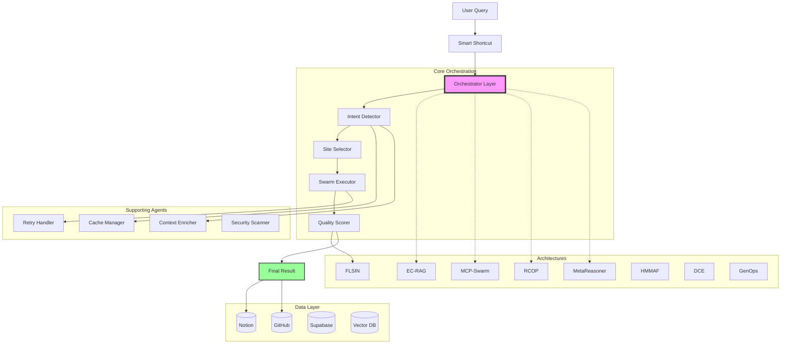
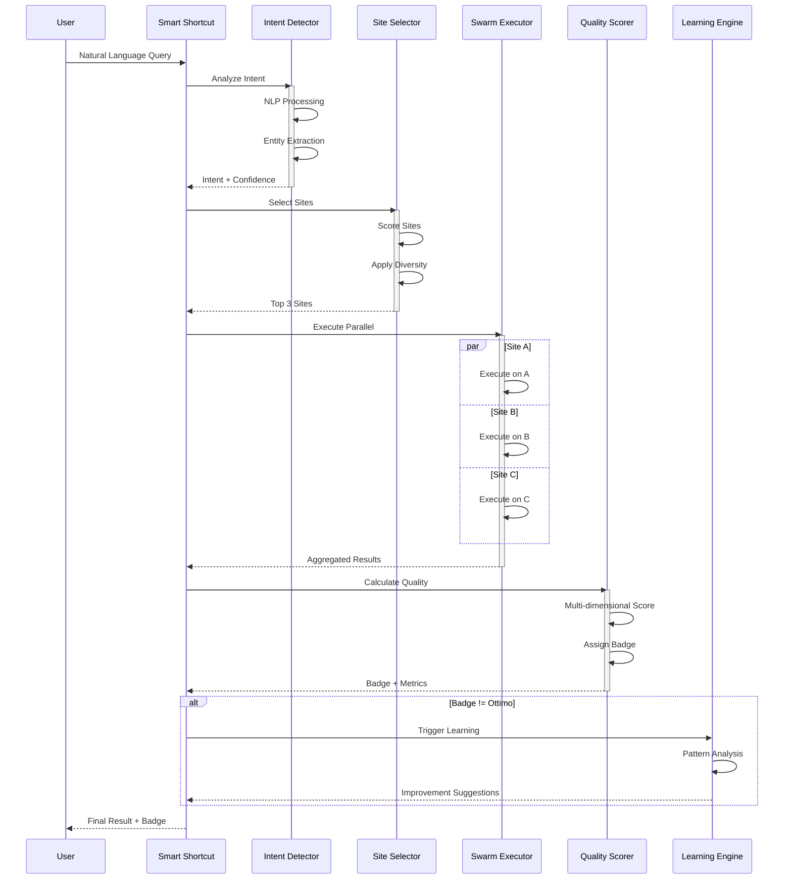
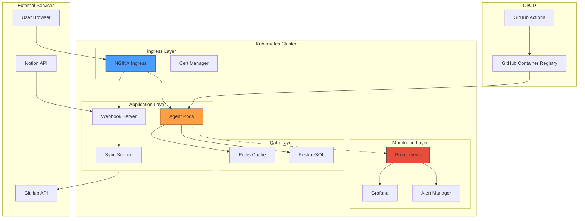
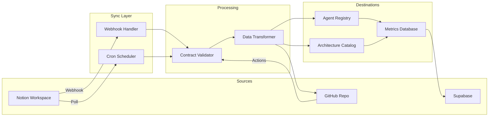
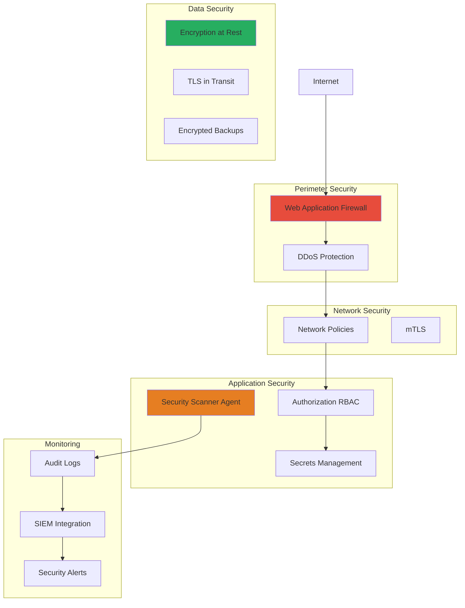
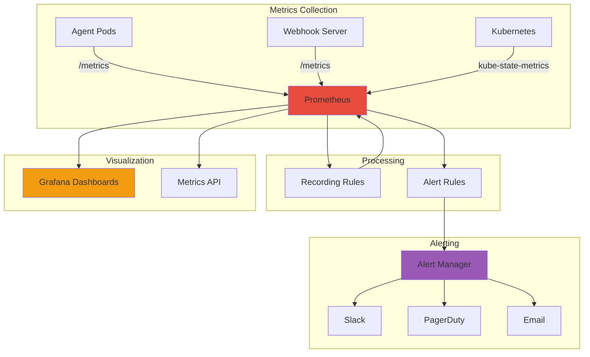

# ASM System Architecture Diagrams

## 🏛️ High-Level Architecture

## 🔄 Execution Flow

## 🏛️ Infrastructure Architecture

## 🔗 Data Flow Architecture

## 🔒 Security Architecture

## 📊 Monitoring Architecture

