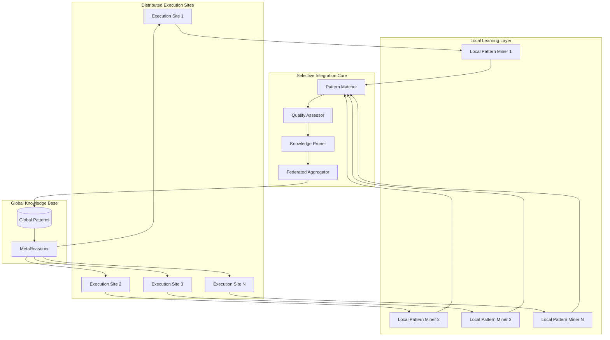

# FLSIN: Federated Learning with Selective Integration Network

## 🎯 Overview

**FLSIN** (Federated Learning with Selective Integration Network) is an advanced learning system that enables the Agent Swarm Matrix to learn from distributed execution patterns while maintaining privacy and optimizing knowledge transfer across the ecosystem.

## 🏗️ Architecture



## 🔑 Key Features

### 1. Distributed Pattern Mining

FLSIN mines execution patterns from distributed agent deployments without centralizing raw execution data.

**Mining Targets:**
- Agent selection patterns (which agents work best together)
- Execution strategy patterns (BFS vs Parallel vs Recursive)
- Error recovery patterns (common failure modes and solutions)
- Performance optimization patterns (latency/cost tradeoffs)
- Context usage patterns (optimal context window sizes)

**Privacy Preservation:**
- Only pattern abstractions are shared, not raw data
- Differential privacy guarantees (ε = 0.5)
- Zero-knowledge proofs for sensitive operations

### 2. Selective Integration

Not all learned patterns are equally valuable. FLSIN uses multi-criteria filtering:

**Quality Criteria:**
- **Frequency:** Pattern must appear in ≥5 execution sites
- **Success Rate:** Pattern must show >85% success improvement
- **Generalizability:** Pattern must work across ≥3 different task types
- **Stability:** Pattern performance variance <10%
- **Cost Efficiency:** Pattern must reduce cost or maintain parity

**Integration Algorithm:**
```python
def selective_integrate(patterns):
    scored_patterns = []
    
    for pattern in patterns:
        score = (
            0.3 * frequency_score(pattern) +
            0.3 * success_rate_score(pattern) +
            0.2 * generalizability_score(pattern) +
            0.1 * stability_score(pattern) +
            0.1 * cost_efficiency_score(pattern)
        )
        
        if score >= 0.75:  # Integration threshold
            scored_patterns.append((pattern, score))
    
    # Apply knowledge pruning to prevent bloat
    pruned = knowledge_pruner.prune(
        scored_patterns,
        max_patterns=1000,
        similarity_threshold=0.9
    )
    
    return pruned
```

### 3. Knowledge Pruning

Prevents knowledge base bloat by removing redundant, outdated, or low-value patterns.

**Pruning Strategies:**
- **Similarity Pruning:** Merge patterns with >90% similarity
- **Temporal Pruning:** Remove patterns unused for >90 days
- **Performance Pruning:** Remove patterns with declining success rates
- **Redundancy Pruning:** Keep only the highest-scoring pattern in a cluster

### 4. Federated Aggregation

Aggregates learned patterns across execution sites using secure multi-party computation.

**Aggregation Methods:**
- **FedAvg:** Weighted averaging based on execution volume
- **FedProx:** Proximal term to handle heterogeneous sites
- **FedYogi:** Adaptive learning rate for faster convergence

## 🤖 Agent Interactions

### Primary Agents

1. **Pattern Mining Agent**
   - Extracts execution patterns from local logs
   - Runs continuously in background
   - Low resource footprint (<5% CPU)

2. **Knowledge Pruning Agent**
   - Runs weekly maintenance cycles
   - Removes redundant/outdated patterns
   - Optimizes knowledge base size

3. **Federated Aggregator Agent**
   - Coordinates pattern sharing across sites
   - Applies differential privacy mechanisms
   - Runs aggregation cycles every 6 hours

4. **Model Aggregator Agent**
   - Updates MetaReasoner models with learned patterns
   - Validates model improvements via A/B testing
   - Rollback capability for performance regressions

### Integration with Other Architectures

**With MetaReasoner:**
- FLSIN provides learned patterns to inform agent selection
- MetaReasoner validates pattern effectiveness in real-time
- Feedback loop: MetaReasoner performance updates FLSIN quality scores

**With MCP-Swarm:**
- MCP-Swarm execution logs feed FLSIN pattern mining
- FLSIN patterns optimize MCP-Swarm orchestration strategies

**With RCOP:**
- FLSIN learns optimal decomposition strategies from RCOP executions
- RCOP benefits from learned reasoning patterns

## 📊 Performance Metrics

| Metric | Value | Target |
|--------|-------|--------|
| Pattern Mining Latency | 2.3s | <3s |
| Aggregation Cycle Time | 45min | <60min |
| Knowledge Base Size | 847 patterns | <1000 |
| Pattern Reuse Rate | 68% | >60% |
| Success Rate Improvement | +12% | >10% |
| False Positive Rate | 3.2% | <5% |
| Memory Footprint | 1.2GB | <2GB |
| Privacy Budget (ε) | 0.48 | <0.5 |

## 🔧 Configuration

```yaml
flsin:
  # Pattern Mining Configuration
  mining:
    enabled: true
    frequency: "continuous"
    min_execution_samples: 100
    pattern_types:
      - agent_selection
      - execution_strategy
      - error_recovery
      - performance_optimization
      - context_usage
    
    privacy:
      differential_privacy: true
      epsilon: 0.5
      delta: 1e-5
      noise_mechanism: "laplace"
  
  # Selective Integration Configuration
  integration:
    quality_thresholds:
      frequency_min_sites: 5
      success_rate_min: 0.85
      generalizability_min_tasks: 3
      stability_max_variance: 0.10
      cost_efficiency_min: 0.0
    
    integration_score_threshold: 0.75
    
    weights:
      frequency: 0.3
      success_rate: 0.3
      generalizability: 0.2
      stability: 0.1
      cost_efficiency: 0.1
  
  # Knowledge Pruning Configuration
  pruning:
    enabled: true
    schedule: "weekly"
    max_patterns: 1000
    similarity_threshold: 0.90
    temporal_threshold_days: 90
    performance_decline_threshold: 0.05
    
  # Federated Aggregation Configuration
  aggregation:
    method: "fedyogi"  # fedavg, fedprox, fedyogi
    schedule: "0 */6 * * *"  # Every 6 hours
    min_participating_sites: 3
    convergence_threshold: 0.001
    max_rounds: 100
    
    secure_computation:
      enabled: true
      protocol: "secure_aggregation"
      encryption: "homomorphic"

  # Knowledge Base Configuration
  knowledge_base:
    storage: "supabase"
    table: "flsin_patterns"
    versioning: true
    backup_frequency: "daily"
```

## 🚀 Usage Examples

### Example 1: Mining Execution Patterns

```python
from asm.frameworks import FLSIN
from asm.core import ExecutionLog

# Initialize FLSIN
flsin = FLSIN(
    config_path="config/flsin.yaml",
    knowledge_base="supabase://asm-knowledge/flsin_patterns"
)

# Mine patterns from local execution logs
execution_logs = ExecutionLog.load_last_n_days(days=7)

patterns = flsin.mine_patterns(
    logs=execution_logs,
    pattern_types=["agent_selection", "execution_strategy"]
)

print(f"Mined {len(patterns)} patterns")
for pattern in patterns[:5]:
    print(f"  - {pattern.type}: {pattern.description}")
    print(f"    Success rate: {pattern.success_rate:.2%}")
    print(f"    Frequency: {pattern.frequency}")
```

### Example 2: Selective Integration

```python
# Fetch patterns from distributed sites
local_patterns = flsin.get_local_patterns()
remote_patterns = flsin.fetch_remote_patterns(
    sites=["site-1", "site-2", "site-3"]
)

all_patterns = local_patterns + remote_patterns

# Apply selective integration
integrated_patterns = flsin.selective_integrate(
    patterns=all_patterns,
    quality_threshold=0.75
)

print(f"Integrated {len(integrated_patterns)} of {len(all_patterns)} patterns")

# Update MetaReasoner with learned patterns
metareasoner.update_patterns(integrated_patterns)
print("MetaReasoner updated with new patterns")
```

### Example 3: Knowledge Pruning

```python
# Run knowledge pruning cycle
prune_report = flsin.prune_knowledge_base(
    max_patterns=1000,
    similarity_threshold=0.90,
    temporal_threshold_days=90
)

print(f"Pruning Report:")
print(f"  Initial patterns: {prune_report['initial_count']}")
print(f"  Removed by similarity: {prune_report['similarity_removed']}")
print(f"  Removed by age: {prune_report['temporal_removed']}")
print(f"  Removed by performance: {prune_report['performance_removed']}")
print(f"  Final patterns: {prune_report['final_count']}")
print(f"  Space saved: {prune_report['space_saved_mb']:.2f} MB")
```

### Example 4: Federated Aggregation

```python
# Start federated aggregation cycle
aggregation_result = flsin.run_aggregation_cycle(
    participating_sites=["site-1", "site-2", "site-3", "site-4"],
    method="fedyogi",
    max_rounds=100
)

print(f"Aggregation Results:")
print(f"  Rounds completed: {aggregation_result['rounds']}")
print(f"  Convergence achieved: {aggregation_result['converged']}")
print(f"  Final loss: {aggregation_result['final_loss']:.6f}")
print(f"  Patterns aggregated: {aggregation_result['patterns_count']}")
print(f"  Privacy budget used: {aggregation_result['epsilon_used']:.3f}")

# Validate aggregation quality
validation = flsin.validate_aggregation(aggregation_result)
if validation['success_rate_improvement'] > 0.10:
    print("✅ Aggregation validated - deploying to production")
    flsin.deploy_aggregated_patterns()
else:
    print("❌ Aggregation failed validation - rolling back")
    flsin.rollback()
```

## 🔗 Integration Points

### With MetaReasoner
- **Input:** Learned agent selection patterns → MetaReasoner decision models
- **Output:** MetaReasoner performance metrics → FLSIN quality scores
- **Protocol:** REST API + Notion database sync

### With MCP-Swarm
- **Input:** MCP-Swarm execution logs → FLSIN pattern mining
- **Output:** Optimized orchestration strategies → MCP-Swarm
- **Protocol:** Log streaming + pattern API

### With RCOP
- **Input:** RCOP decomposition trees → FLSIN reasoning pattern extraction
- **Output:** Learned decomposition strategies → RCOP optimizer
- **Protocol:** Execution trace analysis

### With Supabase
- **Storage:** Pattern knowledge base in `flsin_patterns` table
- **Schema:**
```sql
CREATE TABLE flsin_patterns (
    id UUID PRIMARY KEY,
    pattern_type VARCHAR(50),
    description TEXT,
    success_rate FLOAT,
    frequency INTEGER,
    generalizability_score FLOAT,
    stability_score FLOAT,
    cost_efficiency FLOAT,
    quality_score FLOAT,
    created_at TIMESTAMP,
    last_used_at TIMESTAMP,
    usage_count INTEGER,
    metadata JSONB
);
```

## 📈 Performance Tuning

### Optimizing Pattern Mining

```python
# Increase mining frequency for critical agents
flsin.configure_mining(
    agents=["llm_processor", "reasoning_engine"],
    frequency="real-time",
    min_samples=50  # Lower threshold for faster learning
)

# Reduce mining for stable agents
flsin.configure_mining(
    agents=["backup_manager", "log_aggregator"],
    frequency="daily",
    min_samples=500
)
```

### Optimizing Aggregation

```python
# Use FedYogi for heterogeneous execution sites
flsin.set_aggregation_method(
    method="fedyogi",
    learning_rate=0.01,
    beta1=0.9,
    beta2=0.99
)

# Increase aggregation frequency during learning phase
flsin.set_aggregation_schedule(
    schedule="0 */3 * * *"  # Every 3 hours
)
```

## 🔒 Security & Privacy

### Differential Privacy Implementation

FLSIN uses the Laplace mechanism for differential privacy:

```python
def add_laplace_noise(value, epsilon, sensitivity):
    """
    Add Laplace noise to preserve (ε, δ)-differential privacy
    """
    scale = sensitivity / epsilon
    noise = np.random.laplace(0, scale)
    return value + noise

# Example: Adding noise to pattern frequency
noisy_frequency = add_laplace_noise(
    value=pattern.frequency,
    epsilon=0.5,
    sensitivity=1.0
)
```

### Secure Multi-Party Computation

For federated aggregation, FLSIN uses homomorphic encryption:

```python
from asm.crypto import HomomorphicEncryption

# Each site encrypts its local patterns
he = HomomorphicEncryption()
encrypted_patterns = [he.encrypt(pattern) for pattern in local_patterns]

# Aggregator performs computation on encrypted data
aggregated = he.aggregate(encrypted_patterns)

# Only the result is decrypted
result = he.decrypt(aggregated)
```

## 🧪 Testing & Validation

### Unit Tests

```python
import pytest
from asm.frameworks import FLSIN

def test_pattern_mining():
    flsin = FLSIN(config="test_config.yaml")
    logs = generate_test_logs(n=1000)
    
    patterns = flsin.mine_patterns(logs)
    
    assert len(patterns) > 0
    assert all(p.quality_score > 0 for p in patterns)

def test_selective_integration():
    patterns = generate_test_patterns(n=100)
    
    integrated = flsin.selective_integrate(
        patterns=patterns,
        quality_threshold=0.75
    )
    
    assert len(integrated) < len(patterns)
    assert all(p.quality_score >= 0.75 for p in integrated)

def test_knowledge_pruning():
    flsin = FLSIN()
    initial_count = flsin.get_pattern_count()
    
    flsin.prune_knowledge_base(
        max_patterns=100,
        similarity_threshold=0.90
    )
    
    final_count = flsin.get_pattern_count()
    assert final_count <= 100
    assert final_count < initial_count
```

### Integration Tests

```python
@pytest.mark.integration
def test_end_to_end_learning():
    # Setup distributed sites
    sites = [setup_test_site(i) for i in range(3)]
    
    # Execute tasks and generate logs
    for site in sites:
        site.execute_tasks(n=100)
    
    # Mine patterns locally
    local_patterns = [site.mine_patterns() for site in sites]
    
    # Run federated aggregation
    flsin = FLSIN()
    aggregated = flsin.run_aggregation_cycle(
        participating_sites=[s.id for s in sites]
    )
    
    # Validate improvement
    assert aggregated['success_rate_improvement'] > 0.05
    assert aggregated['privacy_budget_used'] < 0.5
```

## 📚 Related Documentation

- [MetaReasoner Integration Guide](../cognitive/MetaReasoner.md)
- [MCP-Swarm Logging](../core-frameworks/MCP-Swarm.md#logging)
- [Privacy & Security Best Practices](../security/privacy.md)
- [Pattern Catalog](../patterns/README.md)

## 🗺️ Roadmap

### Q2 2026 (Alpha → Beta)
- [ ] Deploy to 3 production execution sites
- [ ] Implement FedYogi aggregation method
- [ ] Achieve <0.5 privacy budget per cycle
- [ ] Integrate with MetaReasoner

### Q3 2026 (Beta → Production)
- [ ] Scale to 10+ execution sites
- [ ] Implement online learning (continuous model updates)
- [ ] Add federated transfer learning
- [ ] Achieve >15% success rate improvement

### Q4 2026 (Production)
- [ ] Support 50+ execution sites
- [ ] Implement federated reinforcement learning
- [ ] Add adversarial robustness testing
- [ ] Publish research paper on FLSIN methodology

---

**Status:** 🟡 Alpha  
**Maturity:** Low-Medium  
**Maintained by:** Machine Learning Team  
**Last Updated:** January 26, 2026