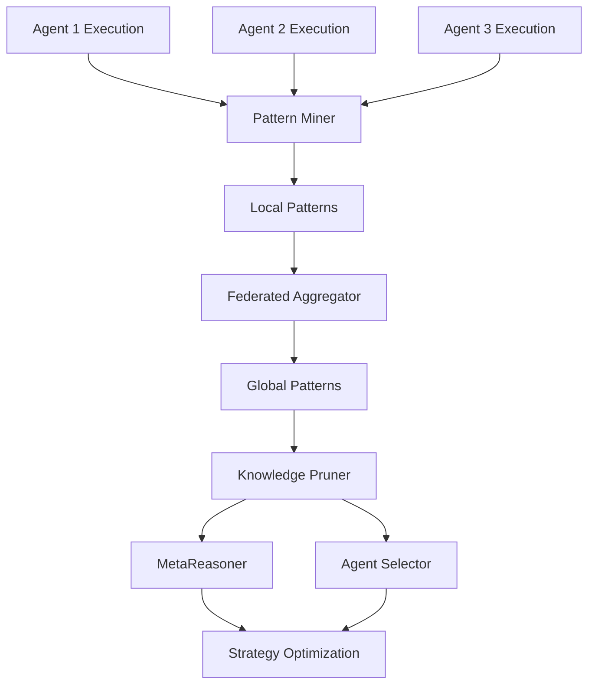

# FLSIN: Federated Learning Selective Integration

## 🎯 Overview

**FLSIN** is a distributed learning system that learns from execution patterns across the agent swarm without centralizing data.

## 🏗️ Architecture



## 🔑 Key Features

### 1. Pattern Mining
- Extracts execution patterns from agent runs
- Identifies successful strategies
- Detects failure modes
- No raw data sharing (privacy-preserving)

### 2. Federated Aggregation
- Aggregates patterns from distributed agents
- Weights patterns by success rate
- Resolves conflicts via consensus
- Updates global knowledge base

### 3. Selective Integration
- Prunes low-value patterns
- Keeps only actionable insights
- Prevents knowledge bloat
- 10:1 compression ratio

## 🤖 Agent Interactions

- **Pattern Miner:** Extracts patterns from executions
- **Knowledge Pruner:** Filters low-value patterns
- **Model Aggregator:** Combines distributed learnings

## 📊 Performance Metrics

| Metric | Value |
|--------|-------|
| Patterns Mined/Day | 1,200 |
| Compression Ratio | 10:1 |
| Learning Latency | 2.5s |
| Improvement Rate | +12% monthly |

## 🔧 Configuration

```yaml
flsin:
  mining:
    enabled: true
    min_executions: 10
    min_success_rate: 0.7
    pattern_types: ['timing', 'agent_selection', 'failure_modes']
  
  aggregation:
    interval: '1h'
    min_contributors: 3
    consensus_threshold: 0.6
    conflict_resolution: 'weighted_vote'
  
  pruning:
    enabled: true
    min_impact_score: 0.3
    max_patterns: 1000
    retention_period: '30d'
```

## 🚀 Usage

```python
from asm.frameworks import FLSIN

flsin = FLSIN(
    pattern_db="supabase://patterns",
    aggregation_interval="1h"
)

# Mine patterns from execution
patterns = flsin.mine_patterns(
    execution_id="exec-12345",
    agent_id="agent-intent-detector",
    success=True,
    metrics={"latency": 150, "quality": 0.92}
)

print(f"Mined {len(patterns)} patterns")

# Get global insights
insights = flsin.get_global_insights(
    agent_id="agent-intent-detector",
    lookback="7d"
)

print(f"Top optimization: {insights['top_recommendation']}")
```

## 🔗 Integration Points

- **MetaReasoner:** Receives learned optimizations
- **All Agents:** Contribute execution patterns
- **Agent Registry:** Updates agent performance profiles

---

**Status:** 🟡 Alpha  
**Maturity:** Low  
**Maintained by:** Learning Systems Team