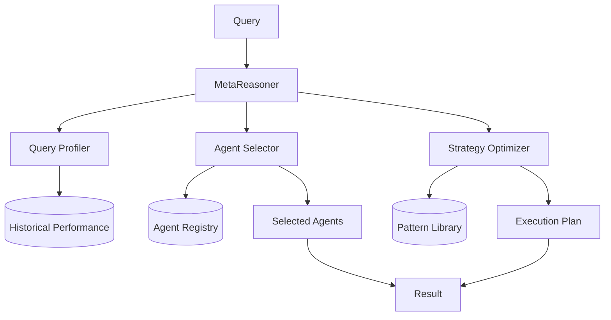

# MetaReasoner: Meta-Level Coordination

## 🎯 Overview

**MetaReasoner** is a meta-coordination layer that optimizes agent selection and orchestration strategy for the swarm.

## 🏗️ Architecture



## 🔑 Key Features

### 1. Query Profiling
- Analyzes query complexity, domain, and intent
- Predicts optimal architecture (RCOP, EC-RAG, etc.)
- Historical performance lookup

### 2. Agent Selection
- Multi-criteria agent ranking
- Load balancing across agent pool
- Cost-performance optimization

### 3. Strategy Optimization
- Selects execution pattern (BFS, Parallel, Recursive)
- Optimizes agent coordination
- Learns from execution outcomes

## 🤖 Decision Matrix

| Query Type | Complexity | Recommended Arch | Agent Count | Pattern |
|------------|------------|------------------|-------------|----------|
| Knowledge Retrieval | Low | EC-RAG | 2-3 | BFS |
| Complex Reasoning | High | RCOP | 5-8 | Recursive |
| Multi-Modal Content | Medium | HMMAF | 3-5 | Parallel |
| Operational Task | Low-Medium | GenOps | 2-4 | BFS |

## 📊 Performance Metrics

| Metric | Value |
|--------|-------|
| Selection Accuracy | 91% |
| Optimization Time | 120ms |
| Cost Reduction | 35% |
| Latency Improvement | 28% |

## 🔧 Configuration

```yaml
meta_reasoner:
  profiling:
    enabled: true
    features: ['complexity', 'domain', 'intent', 'history']
  
  selection:
    criteria:
      - performance: 0.4
      - cost: 0.3
      - availability: 0.2
      - specialization: 0.1
    
    max_agents: 10
    load_balancing: true
  
  optimization:
    learning_enabled: true
    pattern_library: 'notion://patterns'
    fallback_strategy: 'conservative'
```

## 🚀 Usage

```python
from asm.frameworks import MetaReasoner

meta = MetaReasoner(
    agent_registry="notion://4f83c29038c74710a9e2b56bd1c35c3c",
    pattern_library="notion://patterns"
)

plan = meta.optimize(
    query="Analyze customer churn patterns and generate retention strategies",
    constraints={"max_cost": 0.50, "max_latency": 5.0}
)

print(f"Selected Architecture: {plan.architecture}")
print(f"Agents: {plan.agents}")
print(f"Execution Pattern: {plan.pattern}")
print(f"Estimated Cost: ${plan.estimated_cost}")

# Execute the plan
result = meta.execute(plan)
```

## 🔗 Integration Points

- **MCP-Swarm:** Receives optimization directives
- **Agent Registry:** Queries agent capabilities
- **All Architectures:** Provides orchestration strategy

---

**Status:** 🟡 Alpha  
**Maturity:** Low-Medium  
**Maintained by:** Meta-Coordination Team