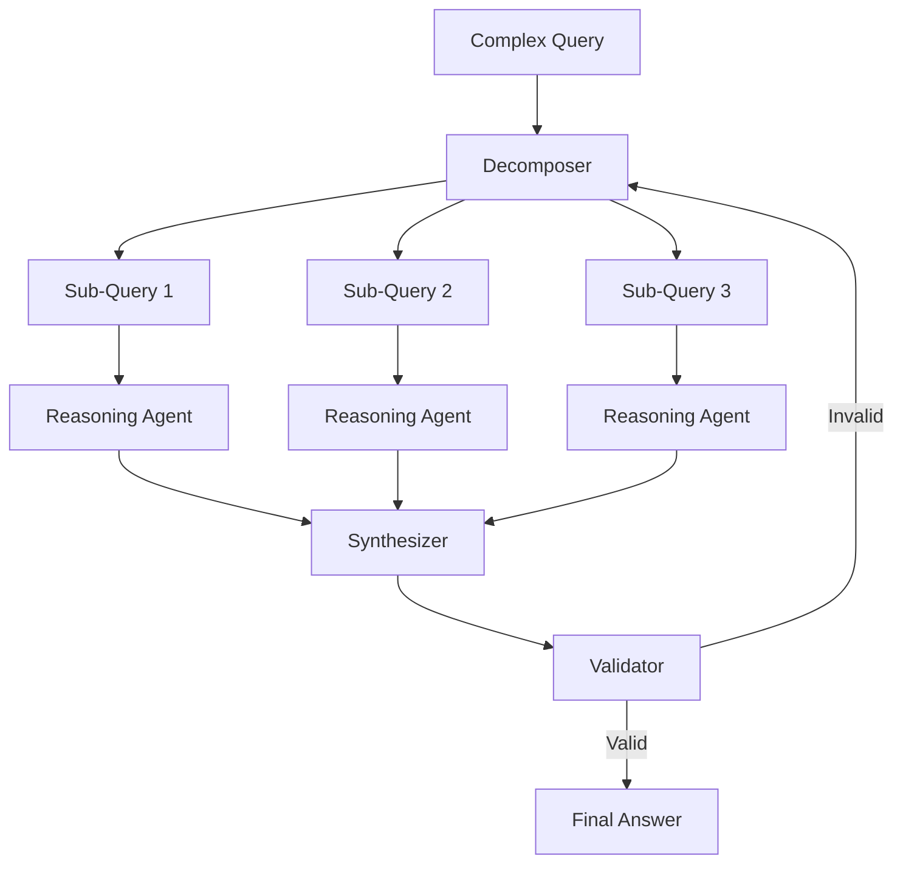

# RCOP: Recursive Chain of Prompts

## 🎯 Overview

**RCOP** is a cognitive architecture that enables complex reasoning through recursive prompt decomposition and synthesis.

## 🏗️ Architecture



## 🔑 Key Features

### 1. Recursive Decomposition
- Breaks complex queries into atomic sub-problems
- Handles nested reasoning up to 5 levels deep
- Automatic complexity detection

### 2. Parallel Reasoning
- Executes sub-queries in parallel
- Reduces overall reasoning time by 60%
- Dynamic agent allocation

### 3. Synthesis & Validation
- Aggregates sub-answers coherently
- Validates logical consistency
- Fallback to human review on low confidence

## 🤖 Agent Interactions

- **Reasoning Engine:** Core RCOP executor
- **Counterfactual Analyzer:** Tests alternative scenarios
- **Context Manager:** Maintains reasoning state

## 📊 Performance Metrics

| Metric | Value |
|--------|-------|
| Avg Reasoning Time | 3.2s |
| Success Rate | 89% |
| Max Recursion Depth | 5 |
| Parallel Branches | 8 |

## 🔧 Configuration

```yaml
rcop:
  decomposition:
    max_depth: 5
    min_complexity_threshold: 0.6
  
  reasoning:
    parallel_execution: true
    max_parallel_branches: 8
    timeout_per_branch: 10s
  
  validation:
    enabled: true
    confidence_threshold: 0.85
    human_review_below: 0.7
```

## 🚀 Usage

```python
from asm.frameworks import RCOP

rcop = RCOP(
    llm="vertex-ai/gemini-2.0-flash",
    max_depth=5
)

result = rcop.reason(
    query="Design a scalable microservices architecture for a fintech platform with CQRS, event sourcing, and blockchain audit trail",
    context={"domain": "fintech", "compliance": "PCI-DSS"}
)

print(result.answer)
print(f"Decomposition tree: {result.tree}")
print(f"Confidence: {result.confidence}")
```

## 🔗 Integration Points

- **MCP-Swarm:** Orchestrates RCOP queries
- **EC-RAG:** Provides context for reasoning
- **MetaReasoner:** Optimizes decomposition strategy

---

**Status:** 🟡 Beta  
**Maturity:** Medium  
**Maintained by:** Cognitive Architecture Team