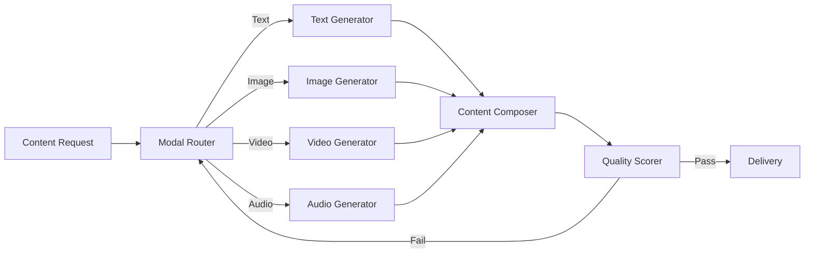

# HMMAF: Hybrid Multi-Modal Agentic Framework

## 🎯 Overview

**HMMAF** generates and processes multi-modal content (text, images, video, audio) through specialized agent coordination.

## 🏗️ Architecture



## 🔑 Key Features

### 1. Multi-Modal Processing
- **Text**: LLM-based generation (Gemini 2.0)
- **Images**: Imagen 3 integration
- **Video**: Veo 2 integration
- **Audio**: Speech synthesis + music generation

### 2. Content Composition
- Combines multiple modalities coherently
- Maintains narrative consistency
- Synchronizes timing across media
- Generates metadata automatically

### 3. Quality Assurance
- Per-modal quality scoring
- Cross-modal coherence checking
- Brand guideline compliance
- Accessibility validation (alt-text, captions)

## 🤖 Agent Interactions

- **Content Generator:** Creates text/image/video/audio
- **Multi-Modal Processor:** Coordinates multi-modal workflows
- **Quality Scorer:** Validates output quality
- **Translation Engine:** Localizes content

## 📊 Performance Metrics

| Metric | Value |
|--------|-------|
| Text Generation | 500ms |
| Image Generation | 8s |
| Video Generation | 45s |
| Quality Score Avg | 8.7/10 |
| Multi-Modal Success | 89% |

## 🔧 Configuration

```yaml
hmmaf:
  text:
    provider: vertex-ai
    model: gemini-2.0-flash
    temperature: 0.7
    max_tokens: 2000
  
  image:
    provider: vertex-ai
    model: imagen-3
    resolution: 1024x1024
    guidance_scale: 7.5
    safety_filter: true
  
  video:
    provider: vertex-ai
    model: veo-2
    duration: 5s
    fps: 24
    quality: high
  
  composition:
    synchronization: true
    narrative_consistency_check: true
    accessibility_mode: true
```

## 🚀 Usage

```python
from asm.frameworks import HMMAF

hmmaf = HMMAF(
    text_model="gemini-2.0-flash",
    image_model="imagen-3",
    video_model="veo-2"
)

# Generate multi-modal content
result = hmmaf.generate(
    prompt="Create a product launch announcement",
    modalities=["text", "image", "video"],
    style="professional",
    brand_guidelines="notion://brand-guide"
)

print(f"Text: {result.text}")
print(f"Image URL: {result.image_url}")
print(f"Video URL: {result.video_url}")
print(f"Quality Score: {result.quality_score}")

# Translate to multiple languages
translated = hmmaf.translate(
    content=result,
    target_languages=["es", "fr", "de", "ja"]
)
```

## 🔗 Integration Points

- **MCP-Swarm:** Triggered for content generation tasks
- **Quality Badge Engine:** Scores content quality
- **GenOps:** Deploys content to production channels

---

**Status:** 🟡 Beta  
**Maturity:** Medium  
**Maintained by:** Content AI Team