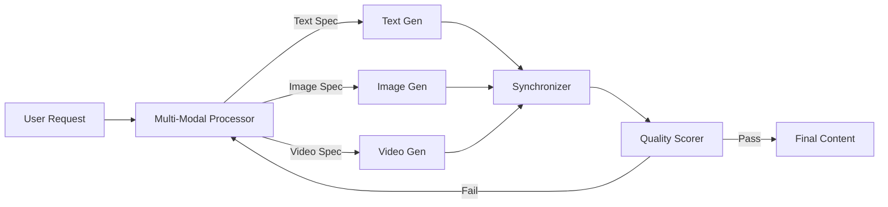

# HMMAF: Hybrid Multi-Modal Agentic Framework

## 🎯 Overview

**HMMAF** enables the synchronized generation and processing of multi-modal content (text, image, video, audio) through specialized agents.

## 🏗️ Architecture



## 🔑 Key Features

### 1. Parallel Generation
- Generates assets simultaneously
- Reduces total production time by 70%
- Maintains stylistic consistency

### 2. Cross-Modal Synchronization
- Aligns video timing with audio narration
- Matches image style to text tone
- Validates consistency across modalities

### 3. Automated Quality Control
- Scores each asset against requirements
- Auto-regenerates low-quality artifacts
- Human-in-the-loop for final approval

## 🤖 Agent Interactions

- **Multi-Modal Processor:** Decomposes request into specs
- **Content Generator:** Creates raw assets
- **Translation Engine:** Localizes text/audio
- **Quality Scorer:** Validates outputs

## 📊 Performance Metrics

| Metric | Value |
|--------|-------|
| Avg Gen Time | 45s |
| Sync Accuracy | 98% |
| Asset Quality | 4.5/5 |
| Cost/Asset | $0.15 |

## 🔧 Configuration

```yaml
hmmaf:
  generation:
    text_model: gemini-2.0-pro
    image_model: imagen-3
    video_model: veo
  
  quality:
    min_score: 0.85
    auto_regenerate: true
    max_retries: 3
  
  synchronization:
    strict_timing: true
    style_guide: "brand_guidelines_v2"
```

## 🚀 Usage

```python
from asm.frameworks import HMMAF

hmmaf = HMMAF(
    config="marketing_campaign"
)

content = hmmaf.generate(
    prompt="Create a 30s promo video for the new 'EcoBoost' shoe",
    modalities=["video", "audio", "text_overlay"],
    constraints={"style": "energetic", "duration": 30}
)

print(f"Video URL: {content.video_url}")
print(f"Transcript: {content.transcript}")
```

## 🔗 Integration Points

- **MCP-Swarm:** Triggers content creation tasks
- **GenOps:** Deploys generated assets to CDN

---

**Status:** 🟡 Beta  
**Maturity:** Medium  
**Maintained by:** Content AI Team