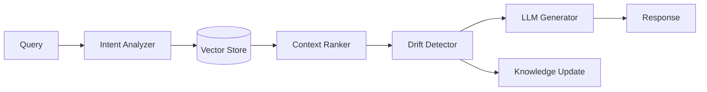

# EC-RAG: Evolution-aware Context RAG

## 🎯 Overview

**EC-RAG** (Evolution-aware Context Retrieval-Augmented Generation) is a production-ready knowledge system that extends traditional RAG with temporal awareness and automatic drift detection.

## 🏗️ Architecture



## 🔑 Key Features

### 1. Temporal Context Tracking
- Timestamps on all knowledge entries
- Version control for evolving facts
- Automatic deprecation of outdated info

### 2. Drift Detection
- Monitors query patterns for concept drift
- Identifies knowledge gaps
- Triggers knowledge base updates

### 3. Multi-Source Integration
- Notion databases
- GitHub repositories
- Web scraping
- API endpoints

## 🤖 Agent Interactions

### Primary Agents
- **Knowledge Ingestion Agent:** Processes new documents
- **Drift Detector Agent:** Monitors for concept drift
- **Context Manager Agent:** Optimizes retrieval
- **Vector Search Agent:** Performs semantic search

## 📊 Performance Metrics

| Metric | Value |
|--------|-------|
| Avg Retrieval Time | 150ms |
| Context Relevance | 92% |
| Drift Detection Rate | 87% |
| Knowledge Freshness | < 1 hour |

## 🔧 Configuration

```yaml
ec_rag:
  vector_db:
    provider: supabase
    embedding_model: vertex-ai/text-embedding-004
    dimensions: 768
  
  drift_detection:
    enabled: true
    threshold: 0.15
    window_size: 1000
  
  context_window:
    max_tokens: 8000
    overlap: 200
```

## 🚀 Usage

```python
from asm.frameworks import ECRAG

rag = ECRAG(
    vector_store="supabase://asm-knowledge",
    embedding_model="vertex-ai/text-embedding-004"
)

# Ingest knowledge
rag.ingest_documents([
    {"content": "...", "source": "notion", "timestamp": "2026-01-25"}
])

# Query with drift detection
result = rag.query(
    "What are the latest PrompTitecture patterns?",
    detect_drift=True
)

print(result.response)
print(f"Drift detected: {result.drift_score}")
```

## 🔗 Integration Points

- **Notion API:** Real-time knowledge sync
- **GitHub MCP:** Code-based knowledge
- **Supabase:** Vector storage
- **Vertex AI:** Embeddings & LLM

## 📚 Related Architectures

- **MCP-Swarm:** Orchestrates EC-RAG queries
- **FLSIN:** Learns from query patterns
- **MetaReasoner:** Optimizes retrieval strategy

---

**Status:** ✅ Production  
**Maturity:** High  
**Maintained by:** Knowledge Systems Team