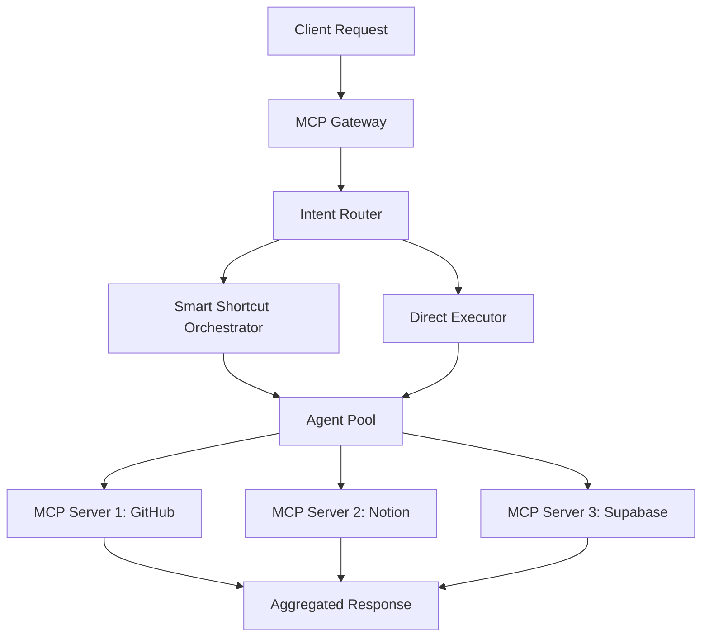

# MCP-Swarm: Model Context Protocol Orchestrator

## 🎯 Overview

**MCP-Swarm** is the orchestration backbone of ASM, enabling agents to access distributed knowledge sources via the Model Context Protocol (MCP).

## 🏗️ Architecture



## 🔑 Key Features

### 1. Multi-Source Context
- GitHub repositories as knowledge
- Notion databases as structured data
- Supabase as vector storage
- Web APIs as dynamic sources

### 2. Smart Shortcut Orchestrator
- Intent-based routing
- Multi-site execution
- Quality scoring
- Result aggregation

### 3. State Management
- Persistent conversation state
- Cross-agent memory
- Session replay

## 🤖 Core Components

### Intent Analyzer
```typescript
interface Intent {
  type: 'search' | 'create' | 'update' | 'analyze';
  entities: string[];
  complexity: 'low' | 'medium' | 'high';
  requiredSources: MCPSource[];
}
```

### Site Selector
```typescript
class SiteSelector {
  selectSites(intent: Intent): Site[] {
    // Logic to select optimal execution sites
    // based on intent complexity and required sources
  }
}
```

### Swarm Executor
```typescript
class SwarmExecutor {
  async execute(intent: Intent, sites: Site[]): Promise<Result> {
    // Parallel execution across selected sites
    // with result aggregation and quality scoring
  }
}
```

## 📊 Performance Metrics

| Metric | Value |
|--------|-------|
| Avg Orchestration Time | 800ms |
| Success Rate | 96% |
| Concurrent Agents | 15 |
| MCP Server Uptime | 99.8% |

## 🔧 Configuration

```yaml
mcp_swarm:
  gateway:
    port: 3000
    max_connections: 1000
  
  mcp_servers:
    - name: github
      uri: mcp://github.com/GaboBase
      resources: ['repositories', 'issues', 'prs']
    
    - name: notion
      uri: mcp://notion.so
      resources: ['databases', 'pages']
    
    - name: supabase
      uri: mcp://supabase.co/asm-project
      resources: ['vectors', 'tables']
  
  orchestration:
    mode: smart_shortcut
    max_parallel_agents: 10
    timeout: 30s
```

## 🚀 Usage

```typescript
import { MCPSwarm } from '@asm/mcp-swarm';

const swarm = new MCPSwarm({
  servers: [
    { name: 'github', uri: 'mcp://github.com/GaboBase' },
    { name: 'notion', uri: 'mcp://notion.so' }
  ]
});

// Execute with smart orchestration
const result = await swarm.execute({
  query: 'Find all agents using EC-RAG architecture',
  mode: 'smart_shortcut',
  sources: ['notion', 'github']
});

console.log(result.data);
console.log(`Quality: ${result.quality_score}`);
```

## 🔗 Integration Points

- **GitHub API:** Code and issue tracking
- **Notion API:** Knowledge base
- **Supabase:** Vector search
- **Vertex AI:** LLM execution

## 📚 Related Architectures

- **EC-RAG:** Knowledge retrieval
- **MetaReasoner:** Agent selection optimization
- **GenOps:** Deployment automation

---

**Status:** ✅ Production  
**Maturity:** High  
**Maintained by:** Core Orchestration Team