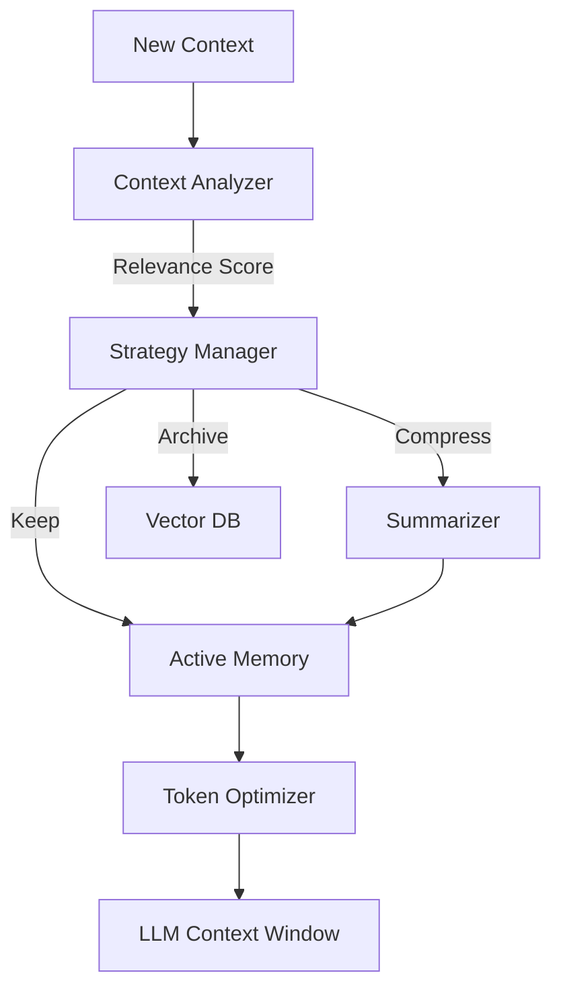

# DCE: Dynamic Context Expansion

## 🎯 Overview

**DCE** (Dynamic Context Expansion) optimizes LLM performance by adaptively managing context windows, ensuring relevant information is retained while minimizing token usage.

## 🏗️ Architecture



## 🔑 Key Features

### 1. Adaptive Window Management
- Dynamically resizes context based on task complexity
- Prioritizes recent and relevant information
- Automatically summarizes older context

### 2. Semantic Compression
- Compresses repetitive information
- Retains key entities and decisions
- Reduces token usage by up to 60%

### 3. Tiered Storage
- **L1 (Active):** Immediate context (RAM)
- **L2 (Compressed):** Summaries (RAM)
- **L3 (Archived):** Long-term history (Vector DB)

## 🤖 Agent Interactions

- **Context Manager:** Orchestrates memory tiers
- **Token Optimizer:** Minifies payloads
- **Drift Detector:** Signals when context is stale

## 📊 Performance Metrics

| Metric | Value |
|--------|-------|
| Token Savings | 55% |
| Recall Accuracy | 94% |
| Latency Impact | +50ms |
| Max Context | 2M |

## 🔧 Configuration

```yaml
dce:
  window:
    initial_size: 8000
    max_size: 2000000
    expansion_rate: 1.5
  
  compression:
    strategy: "semantic"
    threshold: 0.7
  
  archival:
    backend: "supabase"
    retention_days: 90
```

## 🚀 Usage

```python
from asm.frameworks import DCE

dce = DCE(
    llm="gemini-2.0-flash"
)

# Add context
dce.add_context(
    role="user",
    content="Here are the project requirements: ..."
)

# Get optimized context for next call
context = dce.get_context(max_tokens=32000)

print(f"Original Tokens: {dce.stats.original_tokens}")
print(f"Optimized Tokens: {dce.stats.optimized_tokens}")
print(f"Compression Ratio: {dce.stats.compression_ratio}")
```

## 🔗 Integration Points

- **All Agents:** Use DCE for state management
- **EC-RAG:** Provides L3 retrieval

---

**Status:** 🟡 Beta  
**Maturity:** Medium  
**Maintained by:** Core Platform Team