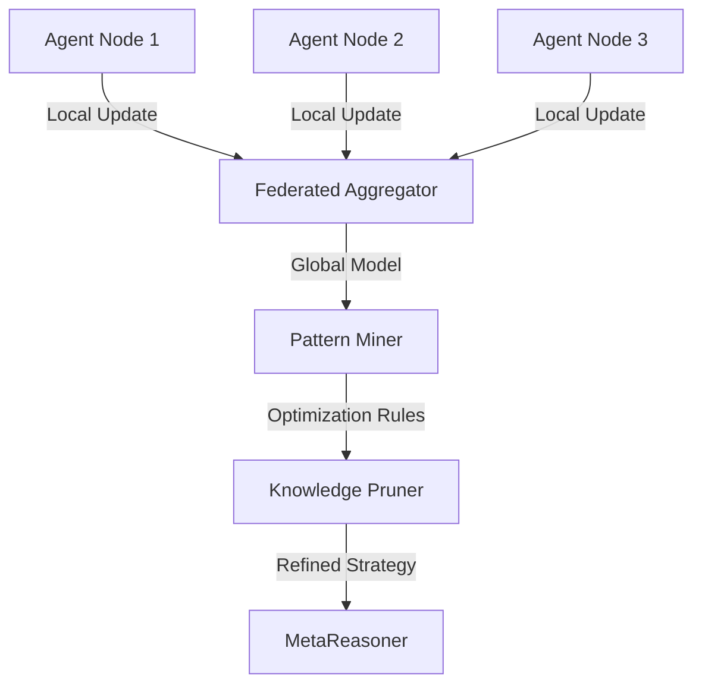

# FLSIN: Federated Learning Selective Integration

## 🎯 Overview

**FLSIN** (Federated Learning Selective Integration) is a learning system that enables agents to learn from distributed execution patterns without sharing sensitive raw data.

## 🏗️ Architecture



## 🔑 Key Features

### 1. Privacy-Preserving Learning
- Agents train on local execution logs
- Only model gradients/weight updates are shared
- No raw customer data leaves the agent boundary

### 2. Selective Integration
- Ignores outliers and anomalous patterns
- Weights updates based on agent success rate
- Automatic rollback of degrading updates

### 3. Continuous Optimization
- Updates MetaReasoner strategies weekly
- Prunes obsolete execution patterns
- Adapts to changing query distributions

## 🤖 Agent Interactions

- **Pattern Miner:** Extracts successful execution chains
- **Knowledge Pruner:** Removes outdated strategies
- **Model Aggregator:** Combines local updates

## 📊 Performance Metrics

| Metric | Value |
|--------|-------|
| Learning Rate | 0.05 |
| Convergence Time | 4.2h |
| Pattern Accuracy | 92% |
| Privacy Score | 100% |

## 🔧 Configuration

```yaml
flsin:
  federation:
    rounds: 10
    min_clients: 5
    strategy: "FedAvg"
  
  privacy:
    differential_privacy: true
    noise_multiplier: 0.5
  
  integration:
    min_accuracy_improvement: 0.01
    rollback_threshold: -0.05
```

## 🚀 Usage

```python
from asm.frameworks import FLSIN

flsin = FLSIN(
    aggregator="fed_avg",
    min_clients=5
)

# Start federated round
round_id = flsin.start_round()

# Agents submit updates
flsin.submit_update(agent_id="ASM-011", weights=local_weights, metrics={"accuracy": 0.95})
flsin.submit_update(agent_id="ASM-012", weights=local_weights, metrics={"accuracy": 0.92})

# Aggregate and deploy
global_model = flsin.aggregate(round_id)
flsin.deploy_strategy(global_model)
```

## 🔗 Integration Points

- **MetaReasoner:** Consumes optimized strategies
- **All Agents:** Provide training data (logs)

---

**Status:** 🟡 Alpha  
**Maturity:** Low  
**Maintained by:** AI Research Team