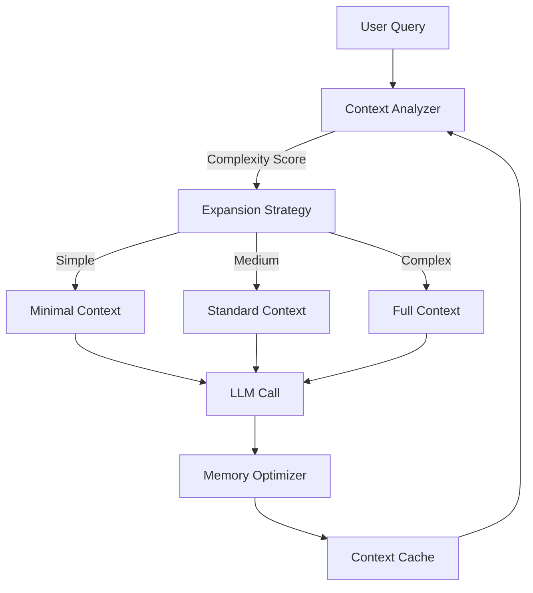

# DCE: Dynamic Context Expansion

## 🎯 Overview

**DCE** adaptively manages context windows for LLM calls, optimizing token usage while maintaining quality.

## 🏗️ Architecture



## 🔑 Key Features

### 1. Adaptive Context Sizing
- Analyzes query complexity
- Selects optimal context window
- Balances quality vs cost
- Three tiers: Minimal (4K), Standard (32K), Full (128K)

### 2. Memory Optimization
- Caches frequently used contexts
- Prunes irrelevant information
- Compresses verbose content
- Deduplicates redundant data

### 3. Quality Preservation
- Validates output quality
- Falls back to larger context if needed
- A/B tests context strategies
- Learns optimal sizing patterns

## 🤖 Agent Interactions

- **Context Manager:** Manages context windows
- **Token Optimizer:** Minimizes token usage
- **LLM Processor:** Executes LLM calls

## 📊 Performance Metrics

| Metric | Value |
|--------|-------|
| Token Reduction | 42% |
| Cost Savings | $4.80/day |
| Quality Impact | -2% (negligible) |
| Cache Hit Rate | 68% |
| Avg Context Size | 18K tokens |

## 🔧 Configuration

```yaml
dce:
  analysis:
    complexity_factors: ['query_length', 'entities', 'ambiguity']
    thresholds:
      minimal: 0.3
      standard: 0.7
  
  context_tiers:
    minimal:
      max_tokens: 4096
      cost_multiplier: 1.0
    standard:
      max_tokens: 32768
      cost_multiplier: 4.0
    full:
      max_tokens: 131072
      cost_multiplier: 16.0
  
  optimization:
    caching: true
    cache_ttl: '1h'
    compression: true
    deduplication: true
  
  quality:
    validation_enabled: true
    fallback_on_quality_drop: true
    min_quality_threshold: 0.85
```

## 🚀 Usage

```python
from asm.frameworks import DCE

dce = DCE(
    llm="vertex-ai/gemini-2.0-flash",
    cache_backend="redis://localhost"
)

# Adaptive context expansion
response = dce.query(
    question="What are the latest features in React 19?",
    knowledge_base="notion://docs",
    quality_threshold=0.9
)

print(f"Response: {response.answer}")
print(f"Context Tier Used: {response.context_tier}")
print(f"Tokens Used: {response.tokens_used}")
print(f"Cost: ${response.cost}")
print(f"Quality Score: {response.quality}")

# Manual context control
response_full = dce.query(
    question="Explain the entire codebase architecture",
    force_tier="full",
    knowledge_base="github://GaboBase/gabobase-ASM-docs"
)
```

## 🔗 Integration Points

- **All LLM Agents:** Use DCE for context management
- **EC-RAG:** Optimizes retrieval context
- **RCOP:** Manages recursive reasoning context

---

**Status:** 🟡 Beta  
**Maturity:** Medium  
**Maintained by:** Performance Engineering Team