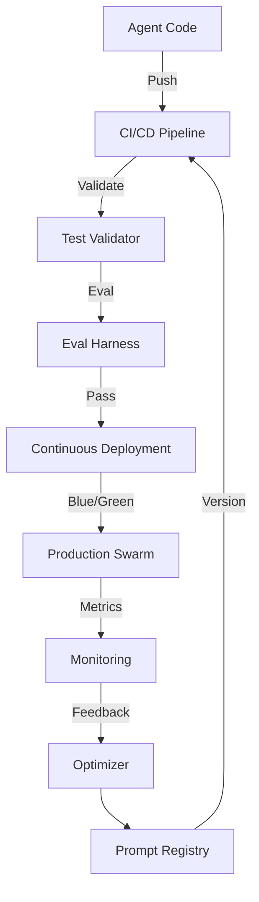

# GenOps: Generative Operations Framework

## 🎯 Overview

**GenOps** (Generative Operations) is the operational backbone of the ASM ecosystem, applying DevOps principles to probabilistic AI workloads. It manages the lifecycle of agents, prompts, and models.

## 🏗️ Architecture



## 🔑 Key Features

### 1. Prompt Versioning
- Git-based version control for prompts
- Semantic diffing (changes in meaning vs. syntax)
- Rollback capabilities for hallucinations

### 2. Probabilistic CI/CD
- **Deterministic Tests:** Unit tests for code
- **Probabilistic Evals:** LLM-based evaluation of outputs
- **Success Criteria:** Statistical thresholds (e.g., >95% accuracy)

### 3. Drift Detection
- Monitors model behavior over time
- Detects concept drift in user queries
- Triggers auto-retraining or prompting adjustments

## 🤖 Agent Interactions

- **Container Orchestrator:** Manages pod lifecycle
- **Deployment Validator:** Runs smoke tests
- **Log Aggregator:** Centralizes telemetry

## 📊 Performance Metrics

| Metric | Target |
|--------|--------|
| Deployment Freq | Daily |
| Rollback Rate | <1% |
| Eval Coverage | 100% |
| MTTR | <15m |

## 🔧 Configuration

```yaml
genops:
  pipeline:
    provider: "github-actions"
    runners: ["self-hosted-gpu"]
  
  evals:
    framework: "deepeval"
    metrics: ["hallucination", "coherence"]
    threshold: 0.9
  
  deployment:
    strategy: "canary"
    steps: [10, 25, 50, 100]
```

## 🚀 Usage

```bash
# Run a GenOps evaluation locally
asm genops run-eval --agent "ASM-001" --test-set "intents_v2.json"

# Deploy an agent with GenOps guardrails
asm genops deploy --agent "ASM-001" --version "2.1.0" --strategy canary
```

## 🔗 Integration Points

- **GitHub Actions:** Triggers pipelines
- **Grafana:** Displays drift metrics

---

**Status:** 🟢 Active  
**Maturity:** High  
**Maintained by:** DevOps Team