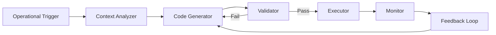

# GenOps: Generative Operations

## 🎯 Overview

**GenOps** automates operational tasks through generative AI, from infrastructure provisioning to incident response.

## 🏗️ Architecture



## 🔑 Key Features

### 1. Infrastructure as Code Generation
- Terraform/Pulumi generation from requirements
- Kubernetes manifests
- CI/CD pipeline configs

### 2. Automated Incident Response
- Log analysis and root cause identification
- Automated remediation scripts
- Rollback procedures

### 3. Documentation Generation
- Auto-generated runbooks
- API documentation
- Architecture diagrams

## 🤖 Agent Interactions

- **Infrastructure Provisioner**
- **Monitoring Agent**
- **Incident Responder**
- **Log Aggregator**

## 📊 Performance Metrics

| Metric | Value |
|--------|-------|
| Avg Response Time | 45s |
| Success Rate | 92% |
| MTTR Reduction | 65% |
| Manual Task Reduction | 78% |

## 🔧 Configuration

```yaml
genops:
  generation:
    provider: vertex-ai
    model: gemini-2.0-pro
    temperature: 0.2
  
  validation:
    enabled: true
    security_scan: true
    compliance_check: true
  
  execution:
    dry_run_first: true
    approval_required_for:
      - production_deploy
      - data_migration
      - security_changes
```

## 🚀 Usage

```python
from asm.frameworks import GenOps

genops = GenOps(
    llm="vertex-ai/gemini-2.0-pro",
    validate=True
)

# Generate infrastructure
iac = genops.generate_infrastructure(
    requirements="Deploy a 3-tier web app with PostgreSQL, Redis, and load balancer on GCP",
    provider="terraform",
    cloud="gcp"
)

print(iac.terraform_code)
print(f"Estimated monthly cost: ${iac.cost_estimate}")

# Apply (with approval)
if iac.validation_passed:
    genops.apply(iac, dry_run=True)
```

---

**Status:** 🟡 Beta  
**Maturity:** Medium  
**Maintained by:** DevOps Team