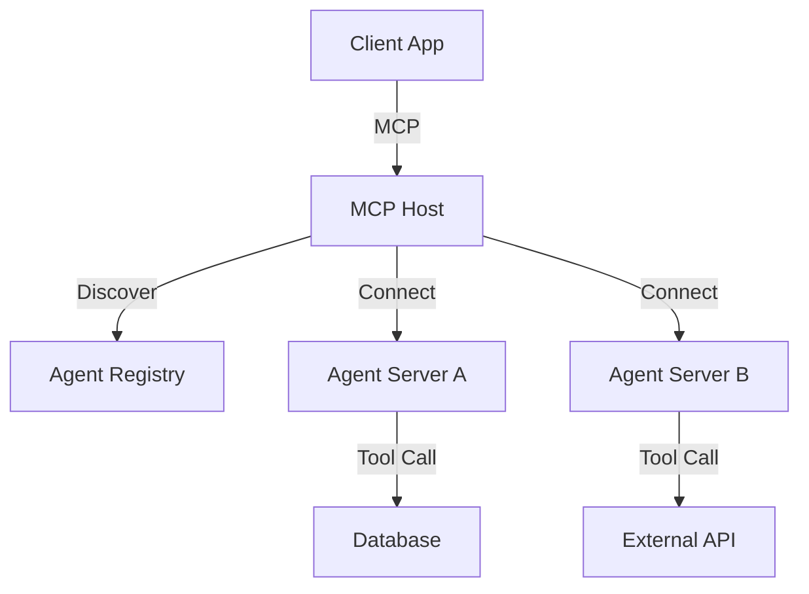

# MCP-Swarm: Model Context Protocol Swarm

## 🎯 Overview

**MCP-Swarm** is the orchestration layer that implements the Model Context Protocol (MCP) to enable standardized, secure, and discoverable communication between agents and tools.

## 🏗️ Architecture



## 🔑 Key Features

### 1. Universal Protocol
- Standardized JSON-RPC 2.0 interface
- Decouples agents from the host application
- "Write once, run anywhere" (Claude, IDEs, Custom Apps)

### 2. Dynamic Discovery
- Agents broadcast their capabilities (tools, resources)
- Hosts dynamically attach agents based on need
- No hardcoded integrations

### 3. Secure Sandboxing
- Agents run in isolated environments
- Explicit permission grants for tool access
- Audit logging of all protocol messages

## 🤖 Agent Interactions

- **Auth Manager:** Validates MCP connection tokens
- **Catalog Manager:** Lists available MCP servers
- **Swarm Executor:** Routes tasks via MCP

## 📊 Performance Metrics

| Metric | Value |
|--------|-------|
| Handshake Time | 10ms |
| Throughput | 5k/s |
| Error Rate | <0.1% |
| Compat | 100% |

## 🔧 Configuration

```yaml
mcp_swarm:
  transport: "stdio" # or "sse"
  version: "1.0.0"
  
  security:
    enforce_permissions: true
    allow_network: false
  
  discovery:
    registry_url: "https://registry.asm.gabobase.dev"
```

## 🚀 Usage

```javascript
// MCP Server Configuration
const server = new McpServer({
  name: "ASM-Swarm",
  version: "1.0.0"
});

server.tool(
  "deploy_agent",
  { agent_id: z.string() },
  async ({ agent_id }) => {
    // Logic to deploy agent
  }
);

const transport = new StdioServerTransport();
await server.connect(transport);
```

## 🔗 Integration Points

- **GenOps:** Deploys MCP servers
- **MetaReasoner:** Discovers tools via MCP

---

**Status:** 🟢 Active  
**Maturity:** High  
**Maintained by:** Platform Engineering